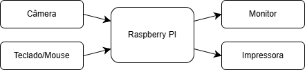

# Photo Booth - Segunda Release

## Disciplina: **PCS3732**

**Grupo J:**

- Arthur Soares Galimberti — NUSP 14559799
- Fernanda Emilio Ortiz — NUSP 14570225
- João Gallego Goulart Viana — NUSP 14581606

**Professor:** Victor Takashi Hayashi

**Data:** 04/08/2026

## Motivação

O projeto tem como objetivo desenvolver um sistema de cabine fotográfica (Photo Booth) de baixo custo utilizando um Raspberry Pi 3B e uma webcam USB Microsoft LifeCam VX-7000. A solução substitui uma arquitetura originalmente baseada em câmera oficial do Raspberry Pi, botões físicos GPIO e impressão automática por uma implementação mais simples, portátil e de fácil manutenção.

A motivação da adaptação é permitir que o sistema funcione utilizando hardware amplamente disponível, reduzindo custos e facilitando futuras expansões. Além disso, toda a interação com o usuário ocorre por meio de uma interface gráfica desenvolvida em Pygame, dispensando componentes eletrônicos adicionais. O sistema foi projetado para salvar as imagens localmente e também imprimir as fotografias.

## Especificação de Requisitos

### Requisitos funcionais
- Exibir uma tela inicial com opção de iniciar a captura.
- Mostrar o preview da câmera em tempo real.
- Permitir a captura da fotografia através de um botão na interface.
- Exibir uma contagem regressiva de 3 segundos antes da captura.
- Manter o preview da câmera ativo durante a contagem regressiva.
- Capturar a imagem da câmera após a contagem.
- Armazenar automaticamente a fotografia.
- Exibir uma tela de revisão da fotografia capturada.
- Permitir ao usuário repetir a fotografia ou imprimir a atual.
- Retornar automaticamente à tela inicial após a impressão.

### Requisitos não funcionais
- Interface gráfica responsiva e intuitiva ao usuário
- Manter taxa de atualização suficiente para fornecer preview contínuo ao usuário.
- Impressão da foto deve ocorrer rapidamente.
- A foto impressa deve ser de qualidade suficiente para distinguir os elementos presentes na imagem do preview.

## Arquitetura Proposta

### Plataforma embarcada

O Raspberry Pi 3 Model B atua como unidade central de processamento do sistema. Nele são executados o sistema operacional, a aplicação do Photo Booth e as bibliotecas responsáveis pela interface gráfica e pela captura de imagens. Além de controlar o fluxo da aplicação, o Raspberry Pi realiza o processamento das imagens capturadas e o armazenamento local das fotografias.

A escolha do Raspberry Pi deve-se ao seu baixo consumo de energia, dimensões reduzidas, disponibilidade de portas USB para conexão de periféricos e capacidade de executar aplicações gráficas em Python de forma satisfatória para esse tipo de sistema embarcado.

### Sistema de captura

A aquisição das imagens é realizada por uma webcam USB Microsoft LifeCam VX-7000, conectada diretamente ao Raspberry Pi. A comunicação com o dispositivo utiliza a interface Video4Linux2 (V4L2), enquanto a captura e o processamento dos quadros são realizados por meio da biblioteca OpenCV.

Durante o funcionamento do sistema, a webcam fornece continuamente um fluxo de vídeo (preview), permitindo que o usuário visualize sua posição antes da captura da fotografia. Após a contagem regressiva, um quadro é capturado e armazenado localmente.

### Interface do usuário

A interação ocorre inteiramente por meio de uma interface gráfica desenvolvida em Pygame, exibida em um monitor conectado ao Raspberry Pi. A interface apresenta as diferentes telas da aplicação, incluindo a tela inicial, a visualização ao vivo da câmera, a contagem regressiva, a revisão da fotografia e as opções de repetir ou finalizar a sessão.

Diferentemente da versão original do projeto, não são utilizados botões físicos conectados às portas GPIO; toda a interação é realizada diretamente pela interface gráfica, com auxílio de teclado e mouse para navegação na interface.

### Armazenamento e Sistema de impressão

As fotografias capturadas são armazenadas no sistema de arquivos do Raspberry Pi, permitindo sua recuperação ou utilização posterior. A impressão das imagens é realizada por uma impressora que está conectada diretamente Raspberry Pi, imprimindo as fotos que foram capturadas pela webcam.